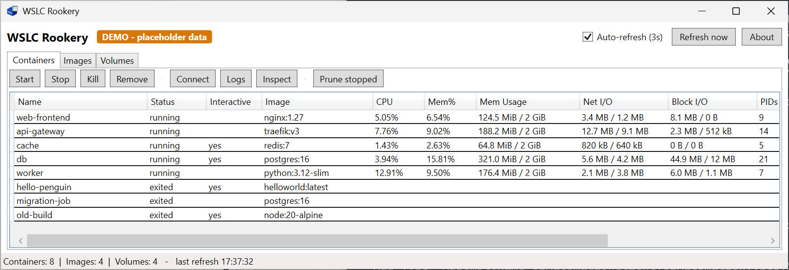
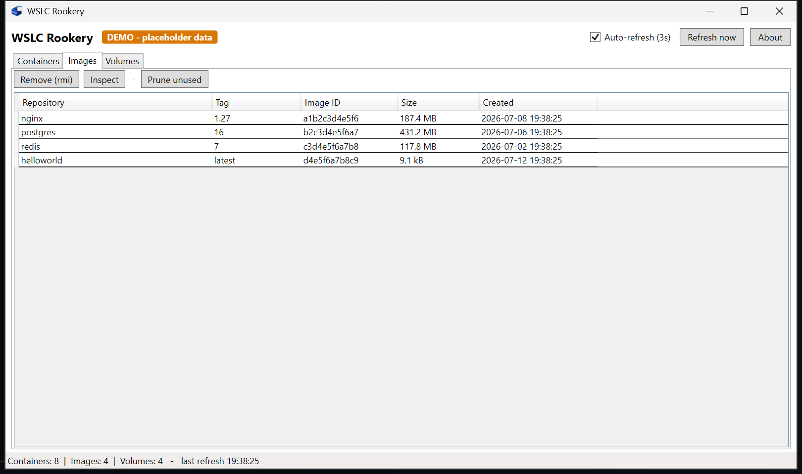
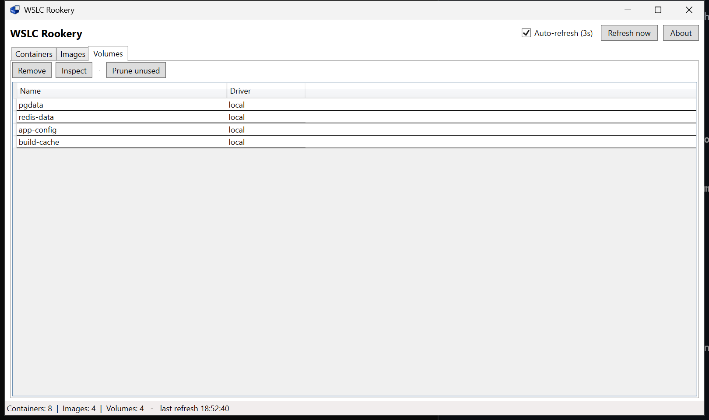

# WSLC Rookery

<p align="center">
  
</p>

A desktop GUI tool for managing [WSL containers](https://learn.microsoft.com/en-us/windows/wsl/wsl-container)
(`wslc.exe`) on a local machine — a big piece missing for `wslc` compared to other desktop container runtimes. A *rookery* is a penguin colony; this one lets you watch over your whole flock of WSL containers at a glance.

It's a single PowerShell 7 + WPF window that polls `wslc.exe` and shows your
images, containers (with live stats), and volumes, with buttons for the common
management actions.

## Screenshots

**Containers** — live grid with per-container stats:



**Images** and **Volumes**:






## Requirements

- Windows with the **WSL container** feature installed (`wslc.exe` on PATH, or at
  `%ProgramFiles%\WSL\wslc.exe`). WSL containers are currently available only as a
  **public preview** in the WSL pre-release build. Install/update it with:

  ```powershell
  wsl.exe --update --pre-release
  ```

  See the [WSL pre-release builds](https://github.com/microsoft/WSL/releases) and
  the [Get started with WSL containers tutorial](https://learn.microsoft.com/en-us/windows/wsl/tutorials/wsl-containers).
- **PowerShell 7** (`pwsh`).

## Run it

Double-click **`Start-WslcRookery.cmd`**, or from a terminal:

```powershell
pwsh -File .\WslcRookery.ps1
```

> WPF needs an STA thread and pwsh 7 has no `-STA` switch, so the script hosts
> its window on a dedicated STA runspace automatically. No extra flags needed.

Add **`-Demo`** to fill the grids with synthetic placeholder data (no real
`wslc` calls) — handy for screenshots and docs:

```powershell
pwsh -File .\WslcRookery.ps1 -Demo
```

## Features

* **Containers** tab — live grid (auto-refresh every 3s) joining `wslc container
list --all` 
    * With `wslc stats`:
Name · Status · Image · CPU% · Mem% · Mem usage · Net I/O · Block I/O · PIDs ·
Container ID · Created
    * Actions: Start · Stop · Kill · Remove · Logs · Inspect · Prune stopped

* **Images** tab — Repository · Tag · Image ID · Size · Created
    * Actions: Remove (rmi) · Inspect · Prune unused

* **Volumes** tab — Name · Driver.
    * Actions: Remove · Inspect · Prune unused

* Toolbar: 
    * Refresh now button and an Auto-refresh (3s) toggle. 

* Status bar shows object counts, last refresh time, and any `wslc` error.
* Destructive actions (kill/remove/prune) ask for confirmation.
* **Logs** and **Inspect** open a scrollable text popup.

## How it works

- All data comes from `wslc <cmd> --format json`, parsed with `ConvertFrom-Json`.
- A background runspace does the polling so the UI never blocks; a
  `DispatcherTimer` copies the latest snapshot into the grids.
- Container status is derived from the JSON `State` field
  (`1=created`, `2=running`, `3=exited`); use **Inspect** for authoritative detail.

## Files

| File | Purpose |
|------|---------|
| `WslcRookery.ps1` | The whole app (data layer + WPF UI + STA bootstrap). |
| `Start-WslcRookery.cmd` | Double-click launcher; runs `pwsh` through headless `conhost` so only the WPF window is visible. |
| `WslcRookery.ico` | Window / taskbar icon (used by the app at runtime). |
| `docs/WSLC Rookery Logo.png` | Logo shown in the README and the About dialog. |

## Limitations

- Read + basic lifecycle management only. No build/run/create/exec/pull/push,
  networks, or registries (use the `wslc` CLI for those).
- `wslc` is an evolving tool; flags/output may change. If a column shows
  blank or an action fails, check the status bar / the popup error text.

## Contributing

This project welcomes contributions and suggestions. Most contributions require you to
agree to a Contributor License Agreement (CLA) declaring that you have the right to, and
actually do, grant us the rights to use your contribution. For details, visit
https://cla.opensource.microsoft.com.

When you submit a pull request, a CLA bot will automatically determine whether you need
to provide a CLA and decorate the PR appropriately (e.g., status check, comment). Simply
follow the instructions provided by the bot. You will only need to do this once across
all repos using our CLA.

This project has adopted the
[Microsoft Open Source Code of Conduct](https://opensource.microsoft.com/codeofconduct/).
For more information see the
[Code of Conduct FAQ](https://opensource.microsoft.com/codeofconduct/faq/) or contact
[opencode@microsoft.com](mailto:opencode@microsoft.com) with any additional questions or
comments.

## Trademarks

This project may contain trademarks or logos for projects, products, or services.
Authorized use of Microsoft trademarks or logos is subject to and must follow
[Microsoft's Trademark & Brand Guidelines](https://www.microsoft.com/en-us/legal/intellectualproperty/trademarks/usage/general).
Use of Microsoft trademarks or logos in modified versions of this project must not cause
confusion or imply Microsoft sponsorship. Any use of third-party trademarks or logos is
subject to those third-parties' policies.

## Disclaimer

This is an informal, community tool. It is **not** an official Microsoft product and is
not covered by Microsoft support. See [SUPPORT.md](SUPPORT.md).

## License

Licensed under the [MIT License](LICENSE).
